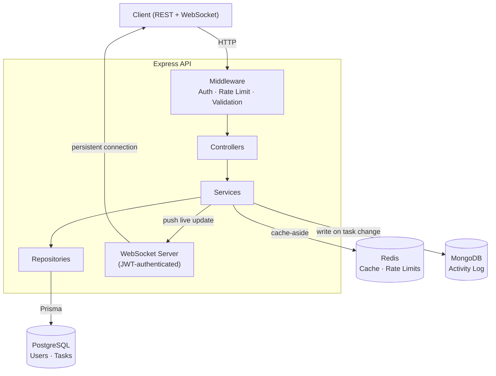

# Task Manager API

A production-grade backend for task management, built from scratch to demonstrate real-world backend engineering: layered architecture, polyglot persistence, real-time updates, and a full CI/CD pipeline to a live deployment.

**Live API:** https://task-manager-api-08ue.onrender.com
_(Free-tier hosting — first request after inactivity may take 30–50s to wake up)_

---

## Features

- **Authentication & Authorization** — JWT access/refresh tokens, bcrypt password hashing, role-based access control (member/admin)
- **Task CRUD** — full create/read/update/delete, ownership-scoped per user, pagination, filtering by completion status
- **Redis caching** — cache-aside pattern with automatic invalidation on writes
- **Rate limiting** — Redis-backed, protects the login endpoint from brute-force attempts
- **Real-time updates** — WebSocket connections pushed live task events to connected clients, authenticated via the same JWT used for REST
- **File uploads** — Multer-based attachment uploads scoped to individual tasks
- **Activity logging** — MongoDB-backed audit log, capturing every task create/delete with flexible per-action metadata (polyglot persistence: relational data in Postgres, high-volume write-heavy logs in Mongo)
- **Admin tooling** — promote-user-role endpoint, admin-only task visibility across all users
- **Fully tested** — 17 Jest + Supertest tests covering CRUD, auth, RBAC, caching, rate limiting, and file uploads
- **CI/CD** — GitHub Actions runs the full test suite (with real Postgres/Redis/Mongo service containers) on every push
- **Containerized** — multi-stage Docker build, full local stack via Docker Compose
- **Deployed** — live on Render (app + Postgres + Redis) with MongoDB Atlas for the activity log

---

## Tech Stack

| Layer                 | Technology                 |
| --------------------- | -------------------------- |
| Runtime               | Node.js 20, TypeScript 5.6 |
| Framework             | Express 5                  |
| Primary DB            | PostgreSQL + Prisma ORM    |
| Cache / Rate Limiting | Redis (ioredis)            |
| Activity Log          | MongoDB + Mongoose         |
| Auth                  | JWT, bcrypt                |
| Real-time             | WebSocket (`ws`)           |
| File Uploads          | Multer                     |
| Validation            | Zod                        |
| Testing               | Jest, Supertest            |
| CI/CD                 | GitHub Actions             |
| Containerization      | Docker, Docker Compose     |
| Deployment            | Render, MongoDB Atlas      |

---

## Architecture



**Request flow:** every REST request passes through auth/rate-limit/validation middleware, then controller → service → repository. Services own all cross-cutting concerns — cache invalidation, activity logging, and WebSocket pushes — keeping repositories focused purely on data access.

**Why three databases:** PostgreSQL holds relational, transactional data (users, tasks, ownership). Redis handles ephemeral, high-speed reads (cache) and counters (rate limiting) — nothing here needs to survive a restart. MongoDB stores the activity log, which is write-heavy, high-volume, and varies in shape per action type — a natural fit for a document store rather than forcing it into relational columns.

---

## API Overview

| Method | Endpoint                       | Auth  | Description                                     |
| ------ | ------------------------------ | ----- | ----------------------------------------------- |
| POST   | `/api/v1/signup`               | —     | Create a new user                               |
| POST   | `/api/v1/login`                | —     | Login, returns access + refresh tokens          |
| POST   | `/api/v1/refresh`              | —     | Exchange a refresh token for a new access token |
| GET    | `/api/v1/tasks`                | User  | List own tasks (paginated, filterable)          |
| POST   | `/api/v1/tasks`                | User  | Create a task                                   |
| GET    | `/api/v1/tasks/:id`            | User  | Get a single task                               |
| PATCH  | `/api/v1/tasks/:id`            | User  | Update a task                                   |
| DELETE | `/api/v1/tasks/:id`            | User  | Delete a task                                   |
| POST   | `/api/v1/tasks/:id/attachment` | User  | Upload a file attachment to a task              |
| GET    | `/api/v1/admin/tasks`          | Admin | List all tasks, all users                       |
| PATCH  | `/api/v1/users/:id/role`       | Admin | Promote/change a user's role                    |
| WS     | `ws://host?token=<jwt>`        | User  | Real-time task event stream                     |

---

## Running Locally

**Requirements:** Docker Desktop (with WSL2 on Windows)

```bash
git clone <repo-url>
cd task-manager-api
cp .env.example .env   # fill in JWT secrets etc.
docker compose up -d --build
node_modules/.bin/prisma migrate deploy
```

App runs at `http://localhost:4000`.

**Running tests:**

```bash
npm test
```

---

## What I'd Do Differently at Scale

- Enforce `role` as a real Prisma/DB-level enum, not just app-layer Zod validation
- Move file storage from local disk to S3-compatible object storage
- Add Redis pub/sub to broadcast WebSocket events across multiple server instances
- Add request tracing/correlation IDs across the REST → Mongo activity-log path
